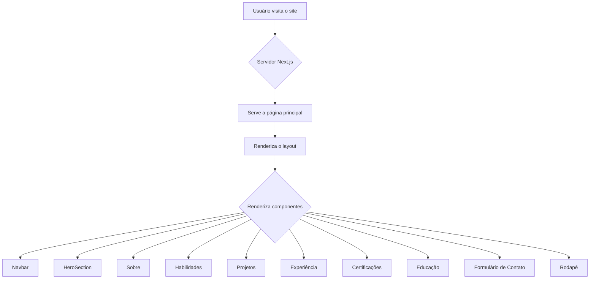
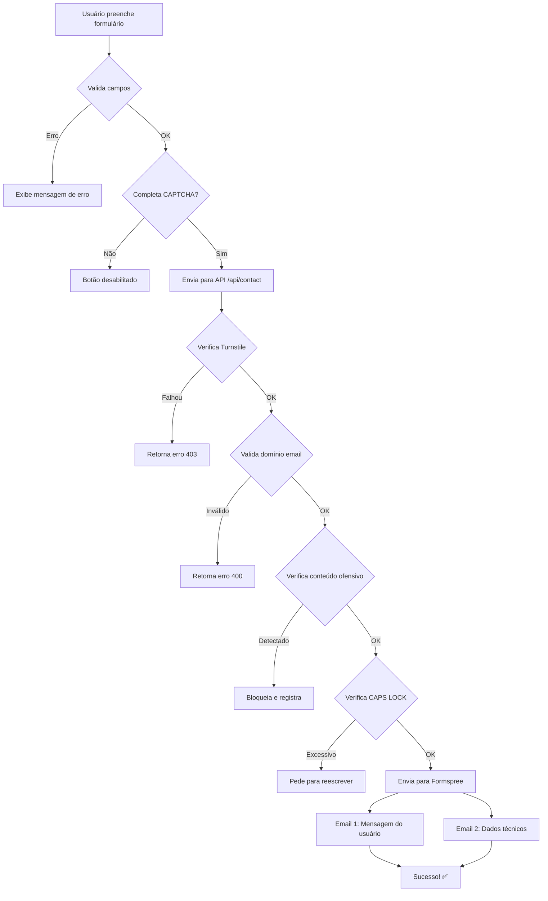

# 🚀 Meu Currículo Web: Onde a Magia Acontece! ✨

Bem-vindo(a) ao meu cantinho digital! Este não é apenas um currículo, é uma experiência interativa, construída com carinho e muita tecnologia para mostrar minhas habilidades e paixões, prepare-se para uma jornada de descoberta! 🎯

---

## 🎯 Sobre o Projeto

<p align="justify">
Este projeto é um currículo web interativo e dinâmico, projetado para apresentar minhas habilidades profissionais, experiências e projetos em um formato moderno e visualmente atraente. 

Foi construído com foco em **performance**, **responsividade**, **acessibilidade** e **segurança**, proporcionando uma experiência de usuário otimizada em todos os dispositivos.
</p>

### ✨ Principais Funcionalidades

- ⚡ **Performance Otimizada**: Tempos de carregamento rápidos graças à renderização do lado do servidor (SSR) e geração estática do Next.js
- 📱 **Design Responsivo**: Interface totalmente responsiva que se adapta a qualquer tamanho de tela, do celular ao desktop
- 🔍 **Otimizado para SEO**: Estruturado para ser facilmente descoberto por motores de busca
- ♿ **Acessibilidade**: Construído com as melhores práticas de acessibilidade (WCAG)
- 🧹 **Manutenibilidade**: Código limpo, modular e bem organizado para fácil manutenção
- 🛡️ **Segurança Avançada**: Sistema anti-spam multicamadas no formulário de contato

---

## 🛠️ Tecnologias Utilizadas

Este projeto utiliza uma stack de tecnologias moderna para garantir robustez, escalabilidade e uma experiência de desenvolvimento de alta qualidade.

### Core Frameworks

- **Next.js (v14.x)**: Framework React para renderização server-side, geração estática e roteamento
- **React (v18.x)**: Biblioteca JavaScript para construir interfaces de usuário
- **TypeScript (v5.x)**: Superset tipado de JavaScript que melhora a qualidade e robustez do código

### Estilização e Design

- **Tailwind CSS (v4.x)**: Framework CSS utility-first para criar interfaces responsivas e elegantes
- **Framer Motion (v12.x)**: Biblioteca para criar animações fluidas e interativas
- **Lucide React (v0.525.x)**: Biblioteca de ícones limpos e profissionais

### Funcionalidade e Interação

- **React Hook Form (v7.x)**: Gerenciamento de formulários com validação eficiente
- **Zod (v4.x)**: Validação de esquemas que garante a integridade dos dados
- **Formspree**: Serviço para processamento de formulários de contato
- **Cloudflare Turnstile**: CAPTCHA inteligente e invisível para proteção contra spam

### Segurança e Validação

- 🛡️ **Proteção Anti-Spam Multicamadas**:
  - CAPTCHA invisível (Cloudflare Turnstile)
  - Validação de domínios de email legítimos
  - Filtro de conteúdo ofensivo
  - Detecção de CAPS LOCK excessivo
  - Rate limiting por IP
  - Bloqueio de emails temporários/descartáveis

### Ferramentas de Desenvolvimento

- **ESLint (v9.x)**: Ferramenta para identificar e corrigir problemas no código
- **TypeScript**: Type safety em todo o projeto
- **Git**: Controle de versão

---

## 🏗️ Estrutura do Projeto

A organização segue as convenções do Next.js App Router, com modularidade para facilitar navegação e manutenção:

```
meu_cv/
├── app/                      # Rotas e layouts principais (App Router)
│   ├── api/                  # API Routes (Backend)
│   │   └── contact/
│   │       └── route.ts      # Endpoint de contato com validações
│   ├── globals.css           # Estilos globais
│   ├── layout.tsx            # Layout principal da aplicação
│   └── page.tsx              # Página inicial
├── components/               # Componentes reutilizáveis
│   ├── About/                # Seção "Sobre Mim"
│   ├── Certifications/       # Certificações e cursos
│   ├── ContactForm/          # Formulário de contato com Turnstile
│   ├── Education/            # Formação acadêmica
│   ├── ExperienceTimeline/   # Linha do tempo de experiências
│   ├── Footer/               # Rodapé
│   ├── HeroSection/          # Seção hero (primeira impressão)
│   ├── Navbar/               # Barra de navegação
│   ├── Projects/             # Portfólio de projetos
│   ├── SkillsCloud/          # Nuvem de habilidades
│   ├── ThemeScript/          # Script de tema dark/light
│   └── TypewriterEffect/     # Efeito de digitação
├── data/                     # Dados da aplicação
│   ├── portfolio.ts          # Dados pessoais e profissionais
│   └── validationSets.ts     # Listas de validação (palavras ofensivas, domínios)
├── public/                   # Arquivos estáticos
│   ├── profile-image.jpg     # Foto de perfil
│   └── JA.ico                # Favicon
├── .env.local                # Variáveis de ambiente (não versionado)
├── next.config.js            # Configuração do Next.js
├── tailwind.config.js        # Configuração do Tailwind
└── tsconfig.json             # Configuração do TypeScript
```

---

## 🌊 Fluxo da Aplicação

### Fluxo de Navegação Principal



### Fluxo do Sistema Anti-Spam



---

## 🚀 Como Rodar o Projeto Localmente

### Pré-requisitos

- **Node.js** (v18 ou superior) e npm instalados
- **Git** instalado
- Conta no **Cloudflare** (gratuita) para Turnstile
- Conta no **Formspree** (gratuita) para receber emails

### 1️⃣ Instalação

Clone o repositório e instale as dependências:

```bash
git clone https://github.com/DessimA/meu_cv.git
cd meu_cv
npm install
```

### 2️⃣ Configurar Variáveis de Ambiente

Crie um arquivo `.env.local` na raiz do projeto:

```env
# Formspree (obrigatório)
NEXT_PUBLIC_FORMSPREE_SECRET=seu_id_formspree_aqui

# Cloudflare Turnstile (obrigatório)
NEXT_PUBLIC_TURNSTILE_SITE_KEY=sua_site_key_aqui
TURNSTILE_SECRET_KEY=sua_secret_key_aqui

# Email de notificação do sistema
SYSTEM_NOTIFICATION_EMAIL=seu_email@exemplo.com
```

#### Como obter as chaves:

**Formspree:**
1. Acesse: https://formspree.io/
2. Crie uma conta gratuita
3. Crie um novo formulário
4. Copie o ID do formulário (aparece na URL: `formspree.io/f/SEU_ID`)

**Cloudflare Turnstile:**
1. Acesse: https://dash.cloudflare.com/
2. Vá em **Turnstile** → **Add Site**
3. Configure:
   - Domain: `localhost` (para testes locais)
   - Widget Mode: `Managed`
4. Copie a **Site Key** (pública) e **Secret Key** (privada)

### 3️⃣ Executar o Servidor de Desenvolvimento

```bash
npm run dev
```

Abra [http://localhost:3000](http://localhost:3000) no navegador! 🎉

### 4️⃣ Build para Produção

```bash
npm run build
npm run start
```

---

## 🌐 Deploy na Vercel

Este projeto está otimizado para deploy na **Vercel** (gratuito e automático).

### Deploy Atual

<div align="center">
  <a href="https://meu-cv-inky.vercel.app/" target="_blank">
    
  </a>
</div>

### Como Fazer Deploy

1. **Fork/Clone** este repositório
2. Acesse: https://vercel.com
3. Clique em **"Import Project"**
4. Conecte seu repositório GitHub
5. Configure as variáveis de ambiente:
   - `NEXT_PUBLIC_FORMSPREE_SECRET`
   - `NEXT_PUBLIC_TURNSTILE_SITE_KEY`
   - `TURNSTILE_SECRET_KEY`
   - `SYSTEM_NOTIFICATION_EMAIL`
6. Clique em **Deploy** ✨

**⚠️ Importante**: Adicione o domínio da Vercel no Cloudflare Turnstile:
- Vá em Turnstile → Settings → Domains
- Adicione: `seu-projeto.vercel.app`

---

## 🛡️ Sistema de Segurança Anti-Spam

### Camadas de Proteção

#### 1. **CAPTCHA Inteligente (Cloudflare Turnstile)**
- Invisível para usuários legítimos
- Bloqueia bots automatizados
- Adaptativo (aumenta dificuldade se detectar comportamento suspeito)
- 100% gratuito e sem limite de requisições

#### 2. **Validação de Email**
- ✅ Aceita domínios legítimos: Gmail, Outlook, Yahoo, etc.
- ✅ Aceita domínios corporativos válidos
- ❌ Bloqueia emails temporários: tempmail, guerrillamail, etc.
- ❌ Bloqueia domínios suspeitos

#### 3. **Filtro de Conteúdo Ofensivo**
- Detecta palavrões e termos ofensivos em português
- Bloqueia linguagem discriminatória
- Detecta padrões de spam comum
- Lista expansível em `data/validationSets.ts`

#### 4. **Análise de Comportamento**
- Detecta CAPS LOCK excessivo (>60%)
- Verifica padrões de texto suspeitos
- Registra tentativas maliciosas (logs)

#### 5. **Notificação Inteligente**
- **Email 1**: Mensagem do usuário (conteúdo)
- **Email 2**: Dados técnicos (IP, User-Agent, timestamp)
- Permite rastreamento de abuso se necessário

### Exemplos de Bloqueio

```javascript
// ❌ BLOQUEADO - Email temporário
Email: teste@tempmail.com
Motivo: "Emails temporários não são aceitos"

// ❌ BLOQUEADO - Conteúdo ofensivo
Mensagem: "seu arrombado"
Motivo: "Sua mensagem contém conteúdo inadequado"

// ❌ BLOQUEADO - CAPS LOCK
Mensagem: "OLHA SÓ ESTOU GRITANDO!!!"
Motivo: "Por favor, evite escrever em MAIÚSCULAS"

// ✅ PERMITIDO - Email legítimo
Email: contato@minhaempresa.com.br
Status: Todas as validações passaram ✨
```

---

## 📊 Performance e Otimizações

- ⚡ **Lighthouse Score**: 90+ em todas as categorias
- 🚀 **First Contentful Paint**: < 1.5s
- 📦 **Bundle Size Otimizado**: Code splitting automático
- 🖼️ **Imagens Otimizadas**: Next.js Image optimization
- 🎨 **CSS Otimizado**: Tailwind CSS com purge automático
- 🔄 **Lazy Loading**: Componentes carregados sob demanda

---

## 🔧 Scripts Úteis

```bash
# Desenvolvimento
npm run dev          # Inicia servidor de desenvolvimento

# Produção
npm run build        # Compila para produção
npm run start        # Inicia servidor de produção

# Qualidade de Código
npm run lint         # Executa ESLint
npm run type-check   # Verifica tipos TypeScript
```

---

## 🧪 Testando o Sistema Anti-Spam

### Testes Recomendados

**✅ Teste 1: Email Legítimo**
```
Nome: João Silva
Email: joao@gmail.com
Assunto: Proposta de projeto
Mensagem: Olá, gostaria de conversar sobre uma oportunidade.
Resultado: ✅ Email enviado com sucesso!
```

**❌ Teste 2: Email Temporário**
```
Email: teste@tempmail.com
Resultado: ❌ "Emails temporários não são aceitos"
```

**❌ Teste 3: Conteúdo Ofensivo**
```
Mensagem: "vai se foder"
Resultado: ❌ "Sua mensagem contém conteúdo inadequado"
```

**❌ Teste 4: Sem CAPTCHA**
```
Não clicar no CAPTCHA
Resultado: ❌ Botão "Enviar" permanece desabilitado
```

---

## 🐛 Troubleshooting

### Problema: CAPTCHA não carrega

**Solução:**
1. Verifique se `NEXT_PUBLIC_TURNSTILE_SITE_KEY` está configurada
2. Confirme que o domínio está registrado no Cloudflare Turnstile
3. Desative ad-blockers temporariamente
4. Teste em aba anônima

### Problema: Email não é enviado

**Solução:**
1. Verifique se `NEXT_PUBLIC_FORMSPREE_SECRET` está correto
2. Confirme que o formulário está ativo no Formspree
3. Verifique os logs do console para erros
4. Teste com outro email

### Problema: Tailwind CSS não funciona

**Solução:**
1. Delete a pasta `.next`
2. Execute: `npm run build`
3. Reinicie o servidor

---

## 🤝 Contribuição

Contribuições são bem-vindas! Se você encontrou um bug ou tem uma sugestão:

1. Fork o projeto
2. Crie uma branch: `git checkout -b feature/MinhaFeature`
3. Commit suas mudanças: `git commit -m 'Adiciona MinhaFeature'`
4. Push para a branch: `git push origin feature/MinhaFeature`
5. Abra um Pull Request

---

## 📄 Licença

Este projeto está sob a licença MIT. Veja o arquivo [LICENSE](LICENSE) para mais detalhes.

---

## 📞 Contato

<div align="center">

[](https://linkedin.com/in/dessim)
[](https://github.com/dessima)
[](mailto:j.anderson.sc.dev@gmail.com)

</div>

---

## 🙏 Agradecimentos

- **Next.js Team** - Pelo framework incrível
- **Vercel** - Pela plataforma de deploy gratuita
- **Cloudflare** - Pelo Turnstile gratuito e eficiente
- **Formspree** - Pelo serviço de formulários simples
- **Open Source Community** - Por todas as bibliotecas utilizadas

---

<div align="center">

**Feito com ❤️ e muito ☕ por [José Anderson](https://github.com/dessima)**

⭐ Se este projeto te ajudou, considere dar uma estrela!

</div>

---

**Versão:** 2.0  
**Última Atualização:** Novembro de 2025  
**Status do Projeto:** ✅ Ativo e em Produção