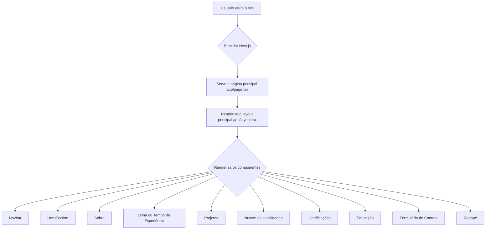
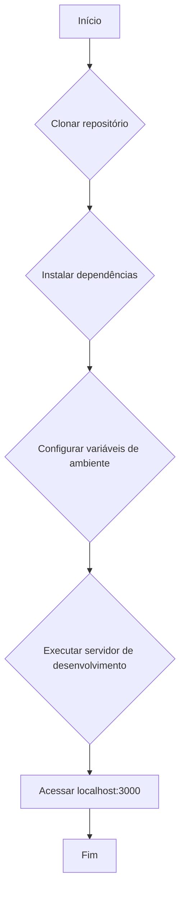

## 🎯 Sobre o Projeto

<p align="justify">
Este projeto é um currículo web interativo e dinâmico, projetado para apresentar minhas habilidades profissionais, experiências e projetos em um formato moderno e visualmente atraente. 

Foi construído com foco em performance, responsividade e acessibilidade, proporcionando uma experiência de usuário otimizada em todos os dispositivos.
</p>

<details>
  <summary>Principais Funcionalidades</summary>
  
  - **Performance Otimizada**: Tempos de carregamento rápidos graças à renderização do lado do servidor e geração estática do Next.js.
  - **Design Responsivo**: Uma interface totalmente responsiva que se adapta a qualquer tamanho de tela, do celular ao desktop.
  - **Otimizado para SEO**: Estruturado para ser facilmente descoberto por motores de busca.
  - **Acessibilidade**: Construído com as melhores práticas de acessibilidade para garantir que seja utilizável por todos.
  - **Manutenibilidade**: Um código limpo, modular e bem organizado para fácil manutenção e futuras atualizações.
</details>

---

## 🛠️ Tecnologias Utilizadas

Este projeto utiliza uma stack de tecnologias moderna para garantir robustez, escalabilidade e uma experiência de desenvolvimento de alta qualidade.

<details>
  <summary>Core Frameworks</summary>
  
  - **Next.js (v14.x)**: Um framework React para renderização do lado do servidor, geração de sites estáticos e roteamento.
  - **React (v18.x)**: Uma biblioteca JavaScript para construir interfaces de usuário.
  - **TypeScript (v5.x)**: Um superset tipado de JavaScript que melhora a qualidade e a robustez do código.
</details>

<details>
  <summary>Estilização e Design</summary>
  
  - **Tailwind CSS (v3.x)**: Um framework CSS utility-first para criar interfaces responsivas e elegantes.
  - **Framer Motion (v10.x)**: Uma biblioteca para criar animações fluidas e interativas.
  - **Lucide React (v0.300.x)**: Uma biblioteca de ícones limpos e profissionais.
</details>

<details>
  <summary>Funcionalidade e Interação</summary>
  
  - **React Hook Form (v7.x)**: Uma biblioteca para gerenciar formulários com validação eficiente.
  - **Zod (v3.x)**: Uma biblioteca de validação de esquemas que garante a integridade dos dados.
  - **Resend**: Utilizado para o envio de e-mails no formulário de contato.
</details>

<details>
  <summary>Ferramentas de Desenvolvimento e Qualidade</summary>
  
  - **ESLint (v8.x)**: Uma ferramenta para identificar e corrigir problemas no código.
  - **Prettier (v3.x)**: Um formatador de código que garante um estilo consistente e legível.
</details>

---

## 🌊 Fluxo da Aplicação

O diagrama abaixo ilustra o fluxo geral da aplicação, desde a primeira visita do usuário até a renderização das diferentes seções do currículo.



---

## 🚀 Começando

Para executar este projeto localmente, siga os passos abaixo.

### Pré-requisitos

- Node.js (v18 ou superior) e npm (ou yarn/pnpm) instalados.
- Git instalado.

### Instalação

1.  Clone o repositório:
    ```bash
    git clone https://github.com/DessimA/meu_cv.git
    cd meu_cv
    ```

2.  Instale as dependências:
    ```bash
    npm install
    ```

### Variáveis de Ambiente

Crie um arquivo `.env.local` na raiz do projeto e adicione as seguintes variáveis. Elas são necessárias para que o formulário de contato funcione corretamente.

```env
# Para o serviço de e-mail Resend
RESEND_API_KEY=sua_chave_api_resend
RESEND_FROM_EMAIL=onboarding@resend.dev
CONTACT_EMAIL=seu_email_de_destino@exemplo.com
```

### Executando o Servidor de Desenvolvimento

Para iniciar o servidor de desenvolvimento, execute o seguinte comando:

```bash
npm run dev
```

Abra [http://localhost:3000](http://localhost:3000) em seu navegador para ver o resultado.

### Fluxo de Execução Local

O diagrama abaixo ilustra o processo de execução do projeto localmente.



---

## 🌐 Deploy

Este projeto está implantado na Vercel. Você pode acessar a versão ao vivo aqui:

<div align="center">
  <a href="https://meu-cv-inky.vercel.app/" target="_blank">
    
  </a>
</div>

---

## 📞 Contato

Se você quiser entrar em contato, pode me encontrar na minha página de contatos:

<div align="center">
  <a href="https://meus-links-olive.vercel.app/" target="_blank">
    
  </a>
</div>
